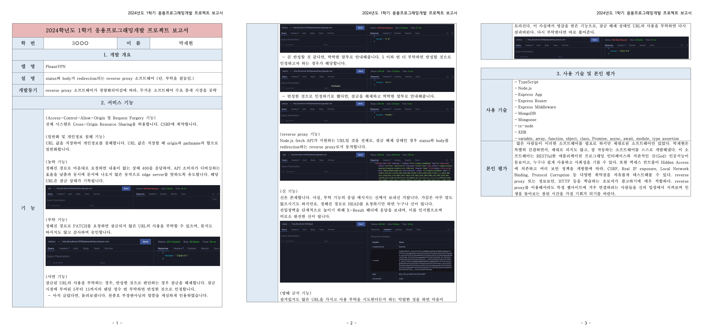

# 2024 응용 프로그래밍 개발

2024학년도 3학년 **응용 프로그래밍 개발** 수업 소스 저장소입니다.

수업시간에 같이 공부한 내용과 모든 실습과제를 여기에 올리시면 됩니다.

## 개인 Repository 사용법 (수업시간에 같이 함)

1. 본 Repository를 본인 컴퓨터에 Clone 합니다. (VSC에서 직접 Clone)

2. STUDENT.md 파일을 수정합니다.

3. 수업시간에 배운 내용과 실습과제를 작성합니다.

4. 소스 파일을 제출합니다. (commit & push)

5. 위 1, 2번은 최초 1번만 수행하고 이후 3, 4번만 반복 수행하면 됩니다.

## 개인 Repository 위치

- [https://github.com/MCPE-PC/2024-dimigo-app-dev](https://github.com/MCPE-PC/2024-dimigo-app-dev)

- github에서 직접 소스를 수정하지 말고, 꼭 VSC에서 github로 올리세요!

## 1학기 프로젝트

.pdf>)
